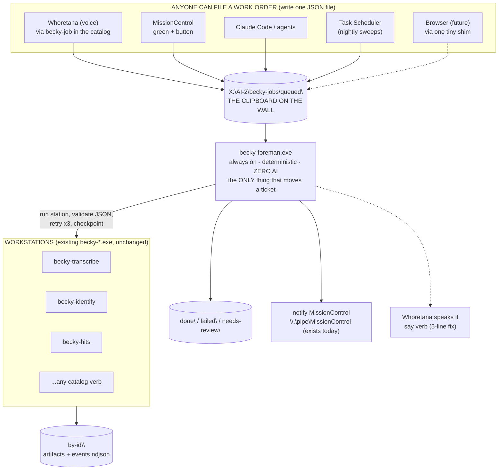

# SPEC — becky-foreman: the deterministic job runtime ("the Factory Foreman")

**Status: SPEC ONLY — nothing is built.** Jordan, 2026-07-14: *"dont build it yet, just
create the spec or prd or whatever."* This document supersedes the guesswork in
`bridge-layer-proposal.md` with a design grounded in what actually exists in the three
repos (verified by read-only survey on 2026-07-14, evidence cited inline).

---

## 0. The answer, in plain language

Today, work only happens while somebody (Jordan or a chat agent) is actively pushing it.
Tools run, finish, and forget. Each app half-believes in communication channels the other
app never built. The fix is **one small, always-on background program —
`becky-foreman.exe`** — that watches a folder of "work orders." Anything that can write a
file can hand it work. The foreman runs becky tools station by station, checks every
result, retries on failure, pauses with a plain-English question when genuinely stuck,
and tells MissionControl / Whoretana when a job finishes.

Three rules make it trustworthy:

1. **No AI inside the foreman.** The AI is a worker it can hire, never the manager.
   Same input → same decisions, zero tokens, fully auditable.
2. **The API is a folder, not a server.** A work order is a JSON file. This kills most
   of the "sandbox gap" outright: PowerShell, `.bat`, Go, C#, C++, Python, Claude Code,
   and VS Code can all write a file with zero bridge code. Only a real Chrome extension
   would ever need a shim (see §7), and none exists today.
3. **Two lanes.** Fast conversational tool calls (Whoretana answering in seconds) stay
   exactly as they are — direct subprocess calls. The foreman is only for jobs: anything
   long, multi-step, scheduled, retryable, or that must survive a crash or a reboot.

---

## 1. Ground truth we verified before designing (2026-07-14)

**What exists:**

- **becky-go has no daemon, no named pipe, no file watcher, no HTTP service.**
  `go.mod` pulls no winio/fsnotify; every `net.Listen` is a loopback GUI helper, a
  transient OAuth receiver, or an ephemeral port handed to a spawned `llama-server`.
  The proposal's premise "our core daemon is listening on a Win32 Named Pipe" is false —
  **there is no core daemon.** The foreman is that missing piece.
- **MissionControl already hosts an inbound notification pipe**: `\\.\pipe\MissionControl`,
  NDJSON, verbs `notify` / `set_status` / `chat` / `presence`
  (`hj-mission-control/src/main.cpp:534-593`). The foreman can notify MC **today, with
  zero MC changes.**
- **Whoretana hosts `\\.\pipe\Whoretana`** but routes only `debrief` / `debrief_end`
  (`WHORETANA/NativeShell/src/DebriefPipeServer.cpp:66-76`). A `say` (speak-this-text)
  capability exists internally (`VoiceBridge::Say`) but is **not reachable from the pipe**.
- **File-handoff is already the proven house pattern**: becky-kanban/goal write atomic
  temp+rename JSON that MC hot-reloads (`cmd/kanban/kanban.go:60-64`); becky-pipeline has
  a resumable per-step manifest with skip-on-existing `--resume` (`cmd/pipeline/main.go:55-83`);
  Becky Review's Q&A answers ride `_forensic_answers.json`.
- **A tool registry with safety tiers already exists**: `internal/catalog`
  (GREEN/YELLOW/RED, unknown→RED) — shared by becky-ask, harness, becky-voice, and
  exposed to Whoretana's brain as its tool list.
- **Compiled workflow recipes already exist**: `internal/workflowdef` (+`internal/forensicrun`)
  — the process-video recipe with conditional steps (`EvalWhen`) and the E4B→12B
  validation ladder, compiled into Go, not prose.
- **Scheduling today = Windows Task Scheduler** (two registered tasks, e.g.
  `scripts/register-clip-sync-task.ps1`, daily 5pm, `-StartWhenAvailable`).
- **Archon (v0.5.0, external `archon.exe` + SQLite DB) is the AI-agent workflow runner**
  MC's Workflows page visualizes. It is *not* usable as the deterministic lane: every run
  costs ≥1 Claude call (title generator), loops are always AI-driven, and there is no
  retry primitive. It stays, unchanged, as the agent lane.

**Drift bugs found (the disease this spec cures — hand-duplicated contracts):**

1. MC sends `{"cmd":"say"}` to Whoretana's pipe (`main.cpp:2108`, Show-Me narration);
   Whoretana's handler silently drops any verb except `debrief`/`debrief_end`. **The
   narration goes nowhere.**
2. MC appends chat to `data\chat-outbox.jsonl` "Whoretana reads this" (`chat.cpp:84-86`);
   **no reader exists** anywhere in Whoretana.
3. MC's pipe accepts `{"presence":...}`; **nothing ever sends it** (`main.cpp:530-531`).
4. `X:\AI-2\CLAUDE.md` says Whoretana pushes status to MC via named pipe; **no such
   outbound code exists** in Whoretana.

---

## 2. The shape



**Job lifecycle (a ticket is always in exactly ONE state = one folder):**

```
queued → running → done
                 → needs-review → (answer file) → running → ...
                 → failed          (after 3 failed attempts at one station)
queued/running → canceled          (cancel marker)
malformed intake → rejected        (never crashes the foreman)
```

---

## 3. Decisions (each is settled; the WHY is attached so nobody re-litigates)

- **D1 — Two lanes.** Quick lane (existing direct subprocess calls, e.g. Whoretana's
  Gemma tool-calls with the green/yellow/red gate) is untouched. Job lane is new.
  *Why:* Whoretana's responsiveness is a hard requirement; putting a queue in the hot
  voice path would make everything worse. The proposal's "every interaction becomes a
  work order" is explicitly rejected.
- **D2 — The API is the filesystem.** Create a job = write JSON to `queued\` (temp-write
  then atomic rename, the kanban.json pattern). Read status = read the file. State
  transition = the foreman renames the ticket into another folder. *Why:* every
  environment on this machine can write a file; it survives crashes by construction;
  Jordan can literally open the folder and see the factory floor; and it deletes two of
  the proposal's three shims (VS Code and PowerShell need nothing at all).
- **D3 — One decider.** Only the foreman moves tickets. Everyone else may create tickets,
  read them, drop a cancel marker, or drop an answer file. *Why:* one writer = no races,
  no locking protocol, no "who owns this job" ambiguity.
- **D4 — Blueprints are compiled Go, not YAML.** A blueprint = ordered stations +
  per-station validation + retry policy, in `internal/blueprint`, following the existing
  `internal/workflowdef` pattern. *Why:* "code is law" — compiled logic can't be skipped
  or reinterpreted, it goes through the five gates like everything else, and we don't
  build a YAML engine (Archon already owns "author a DAG in YAML," for agent work).
- **D5 — Work orders name a blueprint, never a command line.** Inputs are validated
  against the blueprint's declared input keys at intake; stations may only be
  `internal/catalog` verbs. *Why:* trust boundary — a dropped JSON file must never be
  able to execute arbitrary commands.
- **D6 — Zero AI in the control loop.** Validation ladders (Gemma E4B→12B) stay where
  they already live: inside the tools (`internal/forensicrun`). The foreman only checks
  exit codes and JSON contracts. *Why:* the manager must be boring and deterministic; an
  AI can be a *station*, with its output contract-checked like any other.
- **D7 — Retry ×3, then ask a human, in plain English.** Station fails → retry up to 3
  attempts (the house circuit-breaker number), then the ticket moves to `needs-review\`
  with a one-sentence plain question in the JSON, and a notification fires. An answer
  file resumes it. *Why:* matches STANDARDS-ENGINEERING and the existing Becky Review
  Q&A culture — questions surface as cards/voice, never buried in logs.
- **D8 — GPU lock.** Blueprint stations marked `gpu:true` run at most one-at-a-time
  machine-wide (default overall concurrency 2). The foreman kills only child processes
  it spawned (PID-scoped, the clip-sync.ps1 rule) and never touches Whoretana's resident
  brain/TTS servers. *Why:* 8 GB VRAM is a tested hard ceiling; uncoordinated GPU jobs
  are today's real failure mode.
- **D9 — Notifications ride existing rails.** Done/failed/needs-review → one NDJSON line
  to `\\.\pipe\MissionControl` (works today) and, once the 5-line Whoretana fix lands,
  a spoken announcement via the `say` verb (which also fixes drift bug #1). *Why:* zero
  new channels; the channels just finally get used consistently.
- **D10 — NDJSON is the only in-house framing.** The 4-byte length-prefix framing exists
  *only* inside the future Chrome shim because Chrome mandates it there, translated at
  the shim boundary. *Why:* NDJSON is already the standard on every seam in this system
  (MC pipe, Whoretana pipe, VoiceBridge, `internal/seam`); retrofitting 4-byte frames
  everywhere (as the peer-review advice suggested) adds work and a second dialect for
  nothing.

---

## 4. Contracts

**Folder layout** (root `X:\AI-2\becky-jobs\`, overridable via `BECKY_JOBS` env):

```
queued\        <id>.json      anyone may create (temp-write + atomic rename in)
running\       <id>.json      foreman-owned
needs-review\  <id>.json      contains "question": one plain-English sentence
done\          <id>.json
failed\        <id>.json
canceled\      <id>.json
rejected\      <id>.json      malformed intake + <id>.reason.txt (never crash)
answers\       <id>.answer.txt   human/agent drops text here → job resumes
cancel\        <id>              empty marker file = cancel request
by-id\         <id>\ ...         artifacts + events.ndjson (this folder NEVER moves)
```

The ticket (small JSON) moves between state folders; the cargo (artifacts, logs) stays
put in `by-id\<id>\` so open file handles can never block a state transition.

**Work order** (example, realistic):

```json
{
  "id": "20260714-183012-x7k3",
  "blueprint": "ingest-footage",
  "inputs": { "video": "X:\\footage\\2026-07-13.mp4" },
  "created_by": "whoretana",
  "created_at": "2026-07-14T18:30:12-05:00",
  "state": "running",
  "station": 1,
  "attempts": 0,
  "question": "",
  "error_plain": "",
  "history": [
    { "verb": "transcribe", "started": "…", "ended": "…", "exit": 0,
      "output": "by-id/20260714-183012-x7k3/transcribe.json", "verdict": "pass" }
  ]
}
```

`id` = sortable timestamp + 4 random chars. `history` is the audit log ("Contract →
State → Workflow → Audit, every single time"). `error_plain`/`question` are the only
fields written for Jordan's eyes — always one plain sentence, never a stack trace.

**Blueprint** (Go sketch — the whole abstraction, deliberately this small):

```go
// internal/blueprint
type Station struct {
    Verb string                          // catalog verb, e.g. "transcribe"
    Args func(j *Job) []string
    GPU  bool
    Check func(j *Job, out []byte) error // nil = exit 0 is enough
}
type Blueprint struct {
    ID       string        // "ingest-footage"
    Tier     catalog.Tier  // gates who may file it without confirmation
    Inputs   []string      // required input keys, validated at intake
    Stations []Station
}
```

After every station the foreman rewrites the ticket (checkpoint). Restart recovery =
scan `running\`, resume each ticket at its recorded station (stations are re-runnable;
becky tools are deterministic and overwrite their outputs — the becky-pipeline
`--resume` precedent).

**`becky-job` CLI** (thin; this is also what Whoretana's brain calls, via the catalog):

```
becky-job add <blueprint> --input k=v [...]   → prints {"id":...}
becky-job list [--state queued|running|...]
becky-job status <id>
becky-job cancel <id>
becky-job answer <id> "<text>"
```

**Foreman runtime facts:** single instance via named mutex `Global\BeckyForeman`; polls
`queued\` + `answers\` + `cancel\` every 2s (ponytail: poll now, swap to
ReadDirectoryChangesW only if latency ever matters — MC itself polls at 1–3s happily);
auto-start via Task Scheduler ONLOGON hidden task (`register-foreman-task.ps1`,
same pattern as the two existing registered tasks); logs to `by-id\<id>\events.ndjson`
per job plus a small rolling `foreman.log`.

---

## 5. What each system does (and what it does NOT have to change)

| System | v1 change | Later (optional) |
|---|---|---|
| **becky-tools** | new `cmd/foreman`, `cmd/job`, `internal/blueprint` + 2–3 real blueprints. **Existing tools: zero changes** (they're already JSON-in/JSON-out stations). | more blueprints |
| **MissionControl** | **zero code.** Receives notifies on its existing pipe; the jobs folder is human-inspectable. | a "Jobs" panel reading the state folders (reuse the Workflows-page poller pattern); green **+** = write a work order; absorb the auto-sync chain into a blueprint |
| **Whoretana** | **zero code to file jobs** — `becky-job` enters the catalog, so the brain can call it like any tool behind the existing confirm gate. | the ~5-line pipe fix routing `{"cmd":"say"}` → `VoiceBridge::Say` (needed for spoken announcements; independently fixes drift bug #1) |
| **Claude Code / agents** | file work orders with `becky-job`; check status the same way. | an "agent station" type (headless agent run with a JSON contract, validated like any station) |
| **Task Scheduler** | scheduled sweeps become "drop a work order" tasks. | — |
| **Archon** | untouched — remains the AI-agent workflow lane MC visualizes. | a foreman station could launch an Archon workflow if ever useful |

---

## 6. The sandbox questions from the proposal, answered plainly

- **"Our core daemon is listening on a Win32 Named Pipe, is that correct?"** No. No such
  daemon existed. The foreman becomes the missing always-on piece — and its intake API is
  a **folder**, so the "how does X talk to the daemon" question mostly evaporates.
- **Chrome / extensions:** still the one genuinely sandboxed client. When (and only when)
  a real browser client exists, build ONE tiny Go shim: a Chrome Native Messaging host
  (registered under `HKCU\Software\Google\Chrome\NativeMessagingHosts\com.becky.host`)
  that translates Chrome's mandatory 4-byte-framed stdio into work-order files and
  status reads. ~100 lines, no server. **Not built now — no browser client exists.**
- **WebView2 GUIs** (Becky Review etc.) are *not* Chrome-sandboxed — the host app already
  bridges (`window.chrome.webview.postMessage`). No shim, ever.
- **VS Code:** a Node extension can write files natively. Under D2 it needs **nothing** —
  the proposal's named-pipe VS Code client is unnecessary.
- **PowerShell / .bat / .cmd:** write a JSON file. That is the entire integration.
- **Webhooks:** irrelevant locally; they're "call me when done" between machines that can
  already reach each other. The local equivalent is the foreman's pipe notify + folder
  state.

---

## 7. Build phases (each ends with a provable, no-hardware VERIFY)

**P0 — the spine.** `becky-foreman.exe` + `becky-job` + `internal/blueprint` with
built-in fake stations for testing.
*VERIFY (one command, offline, no models):* `becky-foreman --selftest` — creates a temp
jobs root; files 3 orders: (a) two-station pass → asserts `done\` + full history;
(b) station fails twice, passes 3rd → asserts retries recorded, `done\`;
(c) station always fails → asserts `needs-review\` + plain question; drops an answer
file → asserts resume → terminal state; drops a malformed JSON → asserts `rejected\`
with reason; prints `PASS`. Plus the five gates (`go build/vet/test`, gofmt,
`build-all-tools.bat`).

**P1 — always-on for real.** MC pipe notifications; `register-foreman-task.ps1`
(ONLOGON); crash-resume (`kill` mid-job → restart → job completes); GPU lock proven
while Whoretana's brain stays alive; 1–2 real blueprints (e.g. `ingest-footage`:
transcribe --forensic → hits reel).
*VERIFY:* real clip through a real work order end-to-end on Jordan's machine, with
Whoretana running throughout and a notify visible in MissionControl.

**P2 — voice.** `becky-job` added to the catalog pack; the 5-line Whoretana `say` pipe
fix. *VERIFY:* say "Whoretana, transcribe last night's footage" → job filed by voice →
walk away → Whoretana announces completion.

**P3 — browser shim.** Gated on an actual browser client existing. Until then: not built.

---

## 8. Non-goals / rejected alternatives (do not re-propose)

- **MCP server / big tool list** — already rejected project-wide (CLAUDE.md §2).
- **HTTP localhost API in v1** — add only when a client that can't write files appears;
  the Chrome shim wraps the file API first.
- **"Every interaction becomes a work order"** — rejected (D1); the quick lane stays.
- **YAML blueprint engine** — rejected (D4); Archon owns YAML-authored agent workflows.
- **Temporal / Prefect / Airflow / Durable Functions / an event bus product** — the
  foreman *is* the 1% of those systems this machine needs: checkpoint after every
  station, resume on restart. No cluster, no broker, no runtime dependency.
- **Retrofitting 4-byte length-prefix framing onto in-house pipes** — rejected (D10).
- **Building the foreman on Archon** — disqualified (tokens per run, AI-driven loops,
  no retries, third-party binary we don't control).
- **A Windows Service (SCM)** — an ONLOGON hidden Task Scheduler process gives always-on
  with none of the service-account/GPU/session friction.
- **Extending Whoretana or MissionControl into the foreman** — the foreman must outlive
  both windows; it's a separate headless exe, in Go, in becky-go, like every other engine.

---

## 9. Open items (the only genuinely undecided things)

1. **First real blueprints to ship in P1** — proposal: `ingest-footage` and a
   `nightly-radar` (radar → freshness → notify). Jordan picks what he actually wants
   queued while he sleeps.
2. **Where announcements should land by default** — MC notify always; voice announce
   always, or only for jobs Whoretana filed? (One boolean per blueprint; needs Jordan's
   preference, not engineering.)
